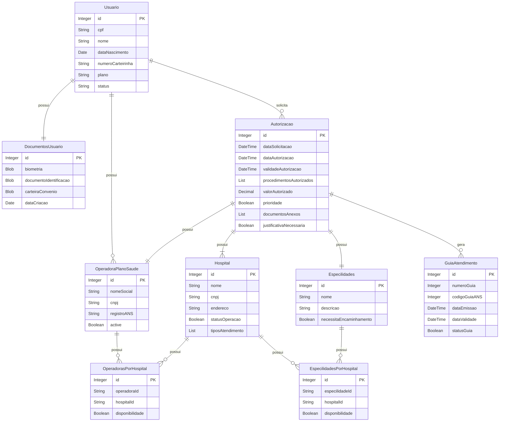

```mermaid
erDiagram
    OperadoraPlanoSaude {
        Integer id PK
        String nomeSocial
        String cnpj
        String registroANS
        Boolean active
        %% JSON parametrosAutorizacao
        %% JSON regrasNegocio
    }

    %% FuncionarioOperadora {
    %%     String id PK
    %%     String nome
    %%     String matricula
    %%     String cargo
    %%     String setor
    %%     Boolean teleAcesso
    %%     String turno
    %% }

    Usuario {
        Integer id PK
        String cpf
        String nome
        Date dataNascimento
        String numeroCarteirinha
        String plano
        String status
    }

    DocumentosUsuario {
        Integer id PK
        Blob biometria
        Blob documentoIdentificacao
        Blob carteiraConvenio
        Date dataCriacao
    }

    Hospital {
        Integer id PK
        String nome
        String cnpj
        String endereco
        Boolean statusOperacao
        List tiposAtendimento
    }

    Especilidades {
        Integer id PK
        String nome
        String descricao
        Boolean necessitaEncaminhamento
    }

    EspecilidadesPorHospital {
        Integer id PK
        String especilidadeId
        String hospitalId
        Boolean disponibilidade
    }

    OperadorasPorHospital {
        Integer id PK
        String operadoraId
        String hospitalId
        Boolean disponibilidade
    }

    %% Totem {
    %%     String id PK
    %%     String localizacao
    %%     DateTime ultimaManutencao
    %%     Boolean statusConexao
    %% }

    %% Checkin {
    %%     String id PK
    %%     DateTime dataHora
    %%     String localizacao
    %%     Boolean prioridade
    %% }

    %% ValidacaoAntiFraude {
    %%     String id PK
    %%     DateTime dataValidacao
    %%     Decimal valorComparacao
    %%     JSON metadadosValidacao 
    %% }

    Autorizacao {
        Integer id PK 
        DateTime dataSolicitacao 
        DateTime dataAutorizacao 
        DateTime validadeAutorizacao 
        List procedimentosAutorizados 
        Decimal valorAutorizado 
        Boolean prioridade 
        List documentosAnexos 
        Boolean justificativaNecessaria 
    }

    %% RegrasAutorizacao {
    %%     String id PK 
    %%     List codigoProcedimento 
    %%     Integer validadeDias 
    %%     Integer limiteCancelamento 
    %% }

    %% AuditoriaOperadora {
    %%     String id PK 
    %%     String tipoAuditoria 
    %%     DateTime dataAuditoria 
    %%     List documentosAnalisados 
    %% }

    GuiaAtendimento {
        Integer id PK 
        Integer numeroGuia 
        Integer codigoGuiaANS 
        DateTime dataEmissao 
        DateTime dataValidade 
        Boolean statusGuia 
    }

    %% Relationships %%
    %% OperadoraPlanoSaude ||--o{ FuncionarioOperadora : possui  
    Usuario ||--o{ OperadoraPlanoSaude : possui  
    Usuario ||--|| DocumentosUsuario : possui  
    Usuario ||--o{ Autorizacao : solicita  
    Autorizacao ||--o{ GuiaAtendimento : gera  
    Autorizacao ||--|{ Hospital : possui  
    %% Hospital ||--o{ Especilidades : possui  
    Autorizacao ||--|| Especilidades : possui  
    Autorizacao ||--|| OperadoraPlanoSaude : possui  
    %% OperadoraPlanoSaude ||--o{ Hospital : possui  
    Hospital ||--o{ EspecilidadesPorHospital : possui  
    Especilidades ||--o{ EspecilidadesPorHospital : possui
    OperadoraPlanoSaude ||--o{ OperadorasPorHospital : possui
    Hospital ||--o{ OperadorasPorHospital : possui
    %% OperadoraPlanoSaude ||--o{ RegrasAutorizacao : define  
    %% OperadoraPlanoSaude ||--o{ AuditoriaOperadora : realiza  
    %% Hospital ||--o{ Totem : possui  
```